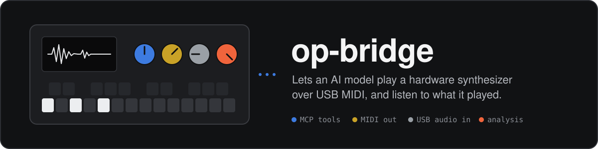
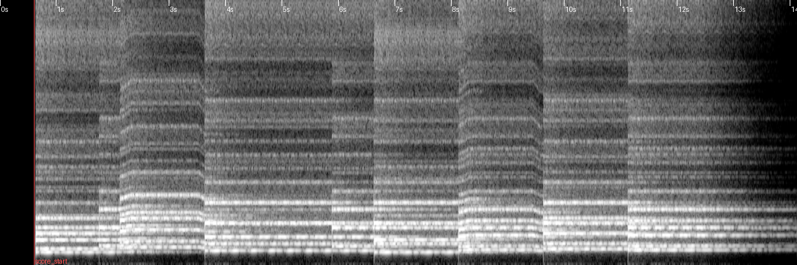
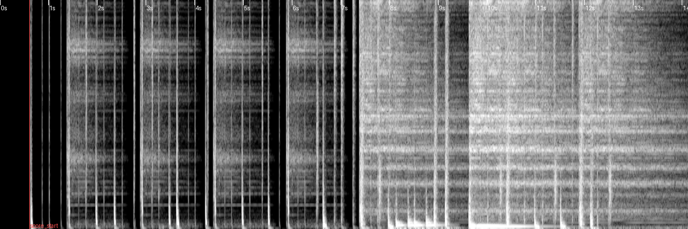
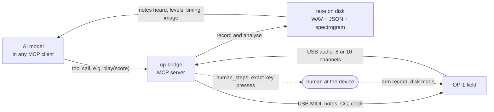

<p align="center">
  
</p>

<p align="center">
  <b>An MCP server that lets an AI model play a Teenage Engineering OP-1 field synthesizer,<br>
  record every take from the device's own audio, and check what was actually heard.</b>
</p>

<p align="center">
  
  
  
  <a href="LICENSE"></a>
</p>

<p align="center">
  <a href="#quick-start">Quick start</a> ·
  <a href="docs/tools.md">All 72 tools</a> ·
  <a href="#making-a-finicky-device-reliable-and-honest">Engineering notes</a> ·
  <a href="docs/device.md">What was verified on the device</a>
</p>

op-bridge connects any MCP client (Claude Desktop, Claude Code, Codex, or claude.ai and ChatGPT
through a tunnel) to an OP-1 field plugged into a Mac. The model picks and designs sounds, plays
scores with velocity, automation and pitch bend, runs the tape and mixer, writes presets, and
programs drums and sequencers. The Field is the instrument and the studio; the computer only sends
MIDI and listens.

The listening is the point. Every take is recorded from the Field's USB audio and measured, so the
model works from what came out of the device, not from what it meant to send.

## What happens when you ask it to play something

1. **It orients itself.** The server's instructions send the model to `get_guide("quickstart")` and
   `get_status`: is the Field connected, which mode the human has set, what the bridge last set on
   the device (the Field cannot be queried), and whether a job is already running.
2. **It chooses a sound from what is known.** Palette notes, `slot_profile` (engine, playable
   range), `find_sounds` over an index of audited slots, then `audition_slots` to hear the
   candidates in one call.
3. **It writes a score and checks it.** `validate_score` checks the notes against the Field's
   voices and range and, in guided mode, the session's key, tempo and parameter limits, before
   anything plays.
4. **It plays and records.** `play(score, record=true)` sets the Field's tempo to the score's, sends
   notes, CC automation, pitch bend and MIDI clock, and records the USB audio at the same time. Anything
   longer than about 25 seconds returns a `job_id` at once; the model polls `job_status` for the
   same result a direct call would give.
5. **It reads what was heard.** A real rehearsal take from 2026-09-30, trimmed (values from the
   take's JSON sidecar):

   ```jsonc
   {
     "take_id": "reh-voices-37-40-20260930-201215",
     "analysis": {
       "live_usb_channels": [3, 4],                       // the selected tape track's pair
       "main_mix": {"peak_db": -9.1, "rms_db": -26.4, "clipping_fraction": 0.0},
       "peak_db": -14.2, "rms_db": -31.0, "clipping_fraction": 0.0,
       "spectral_centroid_hz": {"median": 3996, "min": 1686, "max": 5192},
       "notes_checked": 16, "notes_heard": 16,
       "notes": [
         {"beat": 0.0, "pitch": "F#4", "heard": true, "prominence_db": 43.9, "onset_offset_ms": -4.5}
         // ... 15 more
       ]
     },
     "spectrogram": "view_spectrogram(\"reh-voices-37-40-20260930-201215\")"
   }
   ```

   Then it looks: `view_spectrogram` returns the image below, and `measure_take` adds band levels,
   a pitch track, harmonics and periodic movement when a question needs them.
6. **It asks for hands when it needs them.** Arming a tape track is something MIDI cannot do, so
   the model calls `human_steps("arm_recording")` and relays the exact key presses, then
   `record_to_tape` commits the part. `backup_tape` keeps the stems on the Mac.

<table>
  <tr>
    <td width="50%"></td>
    <td width="50%"></td>
  </tr>
  <tr>
    <td><sub><b>Voices</b>, the take above. The pitch-bend rises written into the score show near 2 s and 8 s.</sub></td>
    <td><sub><b>Drums</b>, four bars at 80 BPM. Each hit is a vertical stroke.</sub></td>
  </tr>
</table>

<sub>Both images are exactly what the model receives from <code>view_spectrogram</code>, rendered by op-bridge from takes
recorded off the Field's USB audio on 2026-09-30. Time runs left to right, 0 to 8 kHz bottom to top; the red mark is the score start.</sub>

## How it works



The server is one Python process ([`src/op_bridge/server.py`](src/op_bridge/server.py)) speaking
MCP over stdio, or Streamable HTTP for remote connectors. One lock guards the device, so two tool
calls never drive it at once.

## What it can do

| Area | What the model gets |
|---|---|
| **Sounds** | Load any of the 16 slots, turn every encoder, randomize, audit and tag a slot from its recorded sound, search an index of sounds by plain description. |
| **Presets** | Author synth and sampler presets as files and install them in a disk-mode round; resample a recorded take into a new instrument. |
| **Playing** | Scores with velocity, swing, humanize, CC automation, pitch bend and sustain, sent with MIDI clock. |
| **Drums** | A step-grid notation (accents, ghosts, ratchets, swing, sections), kit maps of all 24 keys, the endless sequencer over MIDI. |
| **Tape and mix** | Transport, loops, per-track level, pan and mute, master EQ, effects and drive; stem backups. |
| **Arrangement** | A graph of sections and parts compiled to one score per track, recorded track by track. |
| **Listening** | Per-take measurements, spectrograms, `measure_take`, and optional audio-model descriptions ([listening.md](docs/listening.md)). |
| **Voices** | Speech through the Field's vocoder or onto tape through the USB input, scored for intelligibility. Optional; nothing assumes a vocal. |
| **Seeds** | Listen while the human plays and build on their chords, key and tempo. |

The full surface, 72 tools in ten groups, is in [docs/tools.md](docs/tools.md).

## Making a finicky device reliable and honest

The OP-1 field was not built to be driven by software. It cannot report its state, ignores notes on
the wrong channel, silently turns a malformed preset into a sample, and needs a human for several
steps. These are the decisions that make the integration dependable, with the file that shows each.

| Problem | What op-bridge does | Where |
|---|---|---|
| Documentation and reality disagree | Behaviour is tested on a real Field and written down with dates; untested items stay marked **verify**. The model's overview guide marks verified items with `*`. TE's reset CC did nothing in five trials, so `revert_sound` says so and returns the human step that works. | [`docs/device.md`](docs/device.md), [`knowledge.py`](src/op_bridge/knowledge.py) |
| The Field cannot be queried | The bridge records what it last set and reports it in `get_status` with a note saying hand changes are unknown; `set_device_state` takes the human's changes; `detect_mode` guesses synth or drum by ear and labels the result a guess. | [`session.py`](src/op_bridge/session.py), [`server.py`](src/op_bridge/server.py) |
| Some steps need hands on the device | `human_steps` returns exact key presses for over 30 tasks (arm a track, disk mode, sampling, sequencer setup). Tools that hit such a step return the instruction in their result instead of failing. | [`server.py`](src/op_bridge/server.py) |
| Chat clients cut a tool call off near a minute | Work expected to exceed 25 s runs as a background job; `job_status` returns the identical result, `cancel_job` stops it between events and releases held notes. A direct call that cannot get the device within 3 s fails at once, naming the job that holds it. | [`jobs.py`](src/op_bridge/jobs.py), [`server.py`](src/op_bridge/server.py) |
| A bad preset file becomes a sample on the device | Synth presets are composed only from values the Field itself wrote. Staged files are checked before anything is copied, and nothing is copied if one fails; replaced slots are backed up; each file is written under a temporary name, synced and read back before the staged copy is removed. | [`presets.py`](src/op_bridge/presets.py), [device.md §11](docs/device.md#11-preset-files-verified-2026-09-26) |
| A model's opinion is not a measurement | Analysis numbers come from the audio; drum takes are judged by onsets, not pitch. Audio-model descriptions come back labelled as fallible, next to measured levels, and the server tells every connecting model they can be wrong. A Gemini review's `usable` flag means complete, not accurate. | [`player.py`](src/op_bridge/player.py), [listening.md](docs/listening.md) |
| The human stays in charge | Guided mode enforces key, tempo, polyphony, allowed slots and which parameter groups the model may touch. The model can only tighten constraints; the human loosens them from the CLI. Refusals come back as readable tool errors. | [`session.py`](src/op_bridge/session.py) (`Constraints.tighten`, `Config.check`) |
| Secrets and data leaving the machine | API keys are typed with hidden input into an owner-only file outside the repo. Audio goes to Google only on an explicit `backend="gemini"` call. TE's manual is not redistributed; the tools that use it explain how to add your own copy. | [`scripts/set-secret.sh`](scripts/set-secret.sh), [`gemini.py`](src/op_bridge/gemini.py), [`docs/reference`](docs/reference/README.md) |
| Tests without the hardware | Device tests skip themselves when no Field is connected; the rest run offline, including a test that drives the real MCP server over stdio the way a client does. | [`tests/conftest.py`](tests/conftest.py), [`tests/test_mcp_surface.py`](tests/test_mcp_surface.py) |

## Quick start

You need an OP-1 field on USB-C in normal mode, a Mac, Python 3.11+ and [`uv`](https://docs.astral.sh/uv/).

```bash
git clone https://github.com/CrabbTech/op-bridge.git && cd op-bridge
uv sync
uv run op-bridge status        # shows whether the Field's MIDI port and audio device are visible
```

On the Field (hold shift + COM, then T1): set **midi** to channel 1 with clock, notes and other
enabled, and **usb audio** to **10 channel** so the main mix is captured. Grant microphone
permission the first time macOS asks. Then add the server to your client, for example Claude Code:

```bash
claude mcp add op-bridge -- uv --directory /ABSOLUTE/PATH/op-bridge run op-bridge serve
```

Claude Desktop, Codex CLI, and claude.ai or ChatGPT over a tunnel are in
[docs/setup.md](docs/setup.md). Ask for something ("play a slow four-bar progression on synth 3
and tell me what you heard"); the model takes it from there.

> [!NOTE]
> **Guided mode** keeps the model inside limits you set, for example `uv run op-bridge mode guided` and
> `uv run op-bridge constraints set key="D minor" tempo=96 allow_master=false` ([details](docs/setup.md#modes-and-constraints)).

## Files

Everything the bridge records is stored under `~/Music/op-bridge` (or `OP_BRIDGE_HOME`):
sessions of takes, seeds, samples and backups, presets staged for the next disk-mode round, and
`field-backup/` copies of every slot file it replaces. The full layout is in [docs/setup.md](docs/setup.md#files).

## Tests

```bash
uv run pytest -q
```

All tests are functional. Without a Field attached the device-dependent ones skip themselves
(currently 139 passed, 12 skipped), and `OP_BRIDGE_HOME` points at a temporary directory.

<details>
<summary><b>Repository map</b></summary>

| Path | Contents |
|---|---|
| [`src/op_bridge/server.py`](src/op_bridge/server.py) | The MCP server: every tool, the job runner, the device lock. |
| [`src/op_bridge/knowledge.py`](src/op_bridge/knowledge.py) | The guides the model reads through `get_guide`. |
| [`src/op_bridge/device.py`](src/op_bridge/device.py), [`player.py`](src/op_bridge/player.py) | USB MIDI and audio, score playback and take analysis. |
| [`src/op_bridge/analysis.py`](src/op_bridge/analysis.py) | Levels, pitch, harmonics, onsets, modulation, spectrograms, STOI. |
| [`src/op_bridge/presets.py`](src/op_bridge/presets.py), [`sampler.py`](src/op_bridge/sampler.py) | Preset file reading, authoring, validation and install. |
| [`src/op_bridge/drums.py`](src/op_bridge/drums.py), [`kits.py`](src/op_bridge/kits.py) | Drum grid notation and kit maps. |
| [`src/op_bridge/jobs.py`](src/op_bridge/jobs.py) | Background jobs. |
| [`src/op_bridge/session.py`](src/op_bridge/session.py) | Config, modes, constraints, sessions, device state, secrets loading. |
| [`adapters/qwen_audio/`](adapters/qwen_audio) | Optional local audio-model installer and adapter. |
| [`scripts/`](scripts) | Secret storage, Claude Desktop registration, manual extraction, an effect-knob sweep. |
| [`examples/lofi_vocoder_song.py`](examples/lofi_vocoder_song.py) | The script behind the first piece recorded to tape. |

</details>

## Documentation

- [docs/setup.md](docs/setup.md): install, Field settings, every client, modes, CLI, secrets, files.
- [docs/tools.md](docs/tools.md): capabilities and all 72 tools, grouped.
- [docs/listening.md](docs/listening.md): measurements, spectrograms, the optional local and Google listeners.
- [docs/device.md](docs/device.md): the device brief and what was measured on a real Field (served to the model as `get_guide("device")`).
- [docs/reference/](docs/reference/README.md): how to add your own copy of Teenage Engineering's user guide and MIDI tables; they are not distributed here.

## About

Built by Tyler Crabb, working with AI coding agents (Claude Code and Codex), and exercised against a
real OP-1 field; [docs/device.md](docs/device.md) records what was verified on the device.

op-bridge is an independent project, not affiliated with or endorsed by Teenage Engineering.
OP-1 is a trademark of Teenage Engineering.

Released under the [MIT licence](LICENSE).
